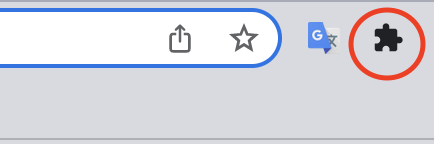
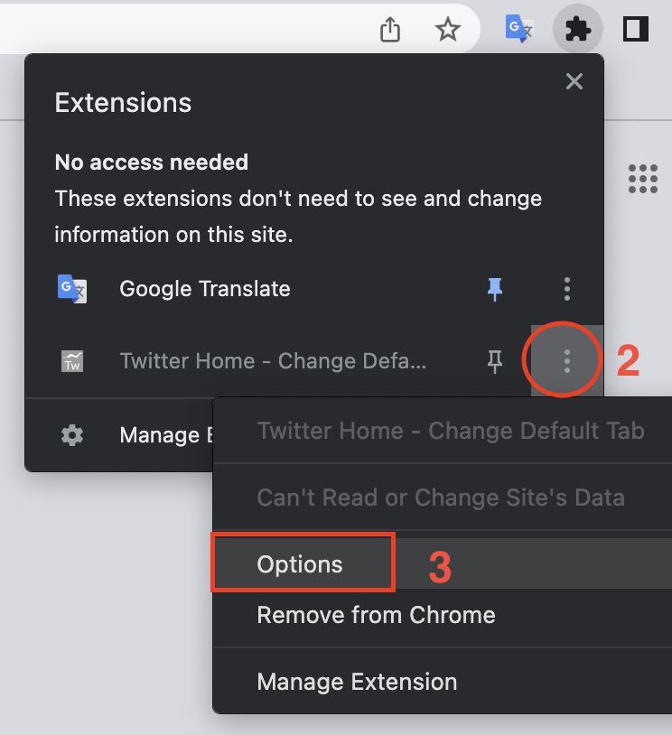
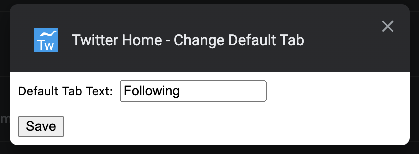

# twitter-home-default-tab-chrome-ext
## Twitter Home extension - Change Default Tab

This extension lets you choose default tab on Twitter home page (and prevent annoying "For You" tab from being open by default). 
You can set the text of the preferred tab in the extension options (defaults to "Following")

The extension tries to find the tab with specified text and then clicks it. It does not access any of your personal data.

# Installation

1. Download the source code using one of the methods:
    - https://github.com/mg-wzl/twitter-home-default-tab-chrome-ext -> "Code" button, then Download ZIP (or clone the repository)
    - [direct link to source code zip](https://github.com/mg-wzl/twitter-home-default-tab-chrome-ext/archive/refs/heads/main.zip)
2. Unzip the archive somewhere safe (don't delete the folder afterwards or the extension won't work properly)
3. In Chrome: install the extension using Developer Mode (see official Google instructions [here](https://developer.chrome.com/docs/extensions/mv3/getstarted/development-basics/#load-unpacked))
    - open "Extensions" ( `chrome://extensions/` )
    - enable Developer Mode
    - press "Load unpacked", chose the unpacked folder
    - disable Developer Mode
4. It's installed!

# Options

You can change the text of the tab in extension options (for different language, for example).

## How to find options:

1. Click jigsaw button to open small Extensions menu 
    - 
2. Click ellipsis symbol near Twitter Home extension
3. Click "Options" menu item
- 
4. Edit "Default Tab Text" field, then press "Save" button
- 
